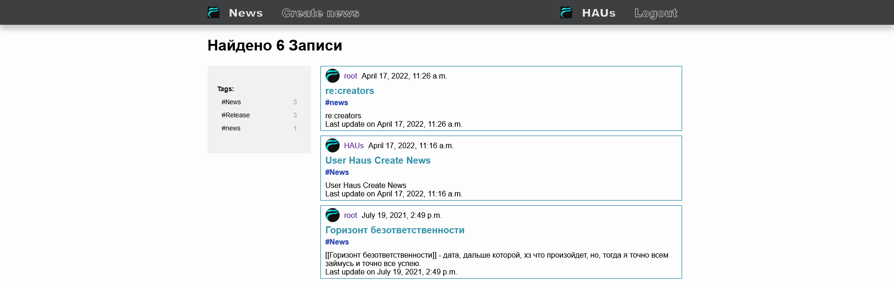
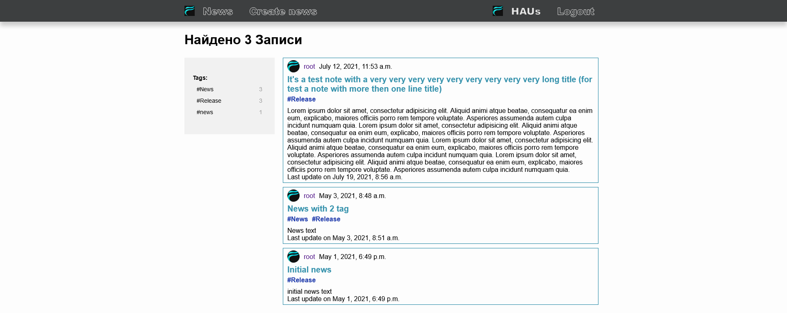

# Django CBV project
Реализация простого блога на с помощью классов представлений.

## Реализованные функции
Для приложения авторизации
 - Sign-up
 - Sign-in
 - Logout

Для приложения блога
- Создание записи
- Комментирование записи
- Фильтрация по тэгу

Также есть страничка профиля, на которой отображаются все посты пользователя

Все записи

Записи по тэгу 

Страница профиля

